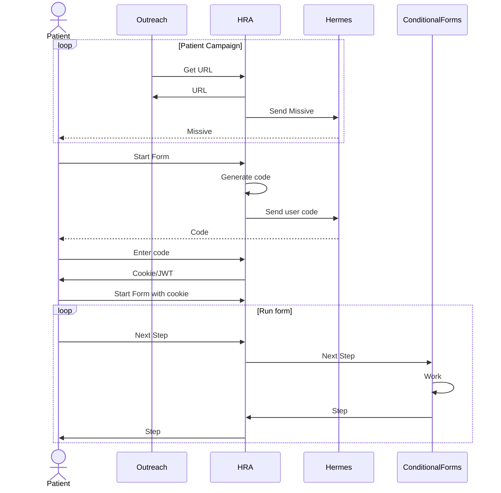
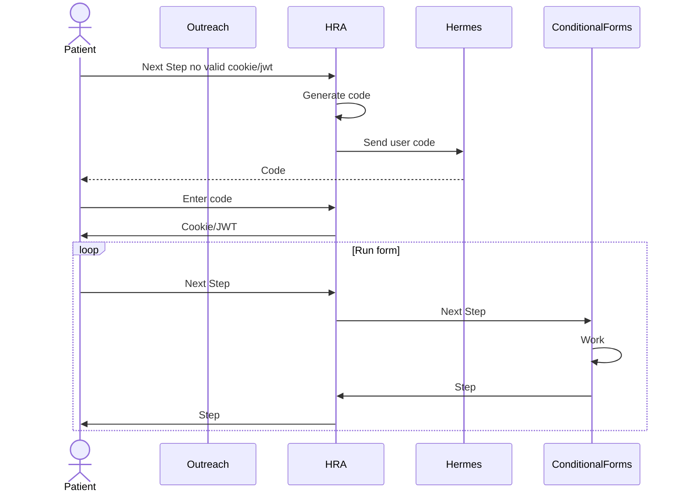

# Conditional Forms HRA Auth

```mermaid
sequenceDiagram

actor u as Patient
participant o as Outreach
participant hra as HRA
participant msg as Hermes
participant cf as ConditionalForms

loop Patient Campaign
    o ->> hra: Get URL
    hra ->> o: URL
    hra ->> msg: Send Missive
    msg -->> u: Missive
end

u ->> hra: Start Form
hra ->> hra: Generate code
hra ->> msg: Send user code
msg -->> u: Code

u ->> hra: Enter code
hra ->> u: Cookie/JWT
u ->> hra: Start Form with cookie
loop Run form
    u ->> hra: Next Step
    hra ->> cf: Next Step
    cf ->> cf: Work
    cf ->> hra: Step
    hra ->> u: Step
end

```

## Resume

```mermaid

sequenceDiagram

actor u as Patient
participant o as Outreach
participant hra as HRA
participant msg as Hermes
participant cf as ConditionalForms

u ->> hra: Next Step no valid cookie/jwt
hra ->> hra: Generate code
hra ->> msg: Send user code
msg -->> u: Code

u ->> hra: Enter code
hra ->> u: Cookie/JWT
loop Run form
    u ->> hra: Next Step
    hra ->> cf: Next Step
    cf ->> cf: Work
    cf ->> hra: Step
    hra ->> u: Step
end

```